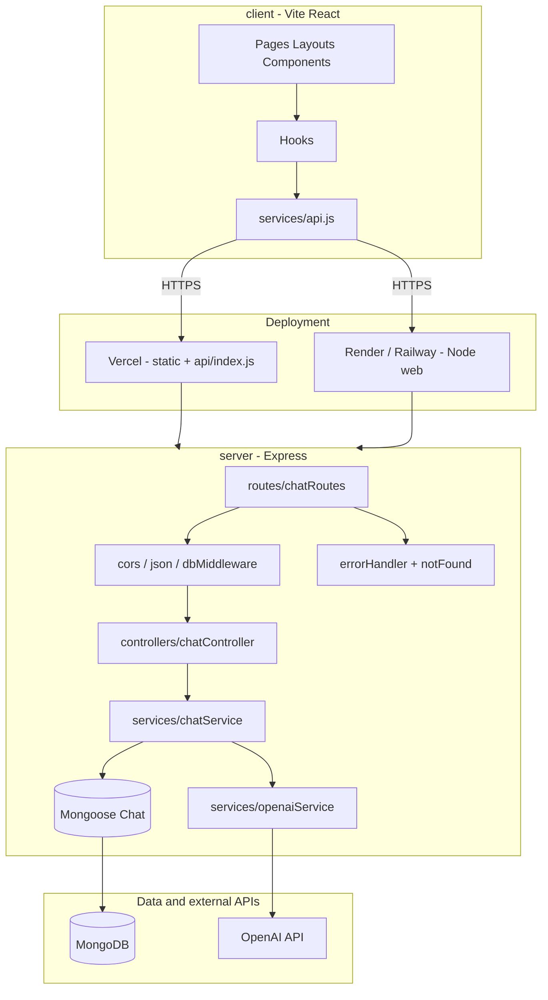

# MeshAI Support

AI-powered customer support SaaS platform using OpenAI GPT.

## Features

- AI chatbot with enterprise-style system prompt
- Context-aware conversations (full thread sent to the model)
- Chat history persisted in MongoDB
- Modern responsive UI with sidebar, navbar, and chat area
- Dark mode, loading states, and typing indicator
- Modular Express API and React components

## Tech Stack

- **Frontend:** React (Vite), Tailwind CSS
- **Backend:** Node.js, Express
- **Data:** MongoDB (Mongoose)
- **AI:** OpenAI API


## Prerequisites

- Node.js 18+
- MongoDB connection string (Atlas or local)
- OpenAI API key

## Local development

1. Copy environment variables:

   ```bash
   copy .env.example .env
   ```

   Edit `.env` with `OPENAI_API_KEY`, `MONGODB_URI`, and optional `OPENAI_MODEL`.

2. Install dependencies (npm **workspaces** — installs `client` + `server`):

   ```bash
   npm install
   ```

3. Run API and web together:

   ```bash
   npm run dev
   ```

   - Client: `http://localhost:5173` (proxies `/api` to the API)
   - API: `http://localhost:3001`

Alternatively run `npm run dev --prefix server` and `npm run dev --prefix client` in two terminals.

## Environment variables

| Variable | Description |
|----------|-------------|
| `OPENAI_API_KEY` | Required. OpenAI secret key |
| `OPENAI_MODEL` | Optional. Defaults to `gpt-4o-mini` |
| `MONGODB_URI` | Required. MongoDB connection URI |
| `CLIENT_URL` | CORS origin(s), comma-separated. Default `http://localhost:5173` |
| `PORT` | API port locally. Default `3001` |
| `VITE_API_URL` | Optional. Full API base URL for the client build (omit when API is same-origin) |

## API overview

| Method | Path | Description |
|--------|------|-------------|
| `GET` | `/health` | Liveness JSON |
| `GET` | `/api/chats` | List chat summaries |
| `POST` | `/api/chats` | Create chat |
| `GET` | `/api/chats/:id` | Chat with messages |
| `DELETE` | `/api/chats/:id` | Delete chat |
| `POST` | `/api/chats/:id/messages` | Append user message, model reply |


## Mermaid diagram


