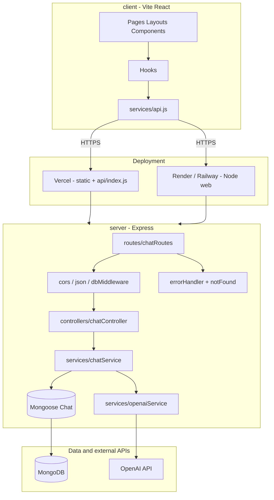

# Architecture

## Overview

MeshAI Support is a monorepo: a Vite React client, an Express API, and a Vercel serverless entry that reuses the same Express application for unified behavior in development and on Vercel.

## Repository layout

| Path | Role |
|------|------|
| `client/` | SPA: UI, hooks, API client |
| `server/` | Express app: routes, controllers, services, Mongoose models |
| `api/` | Vercel function wrapper (CommonJS) importing `server` ESM |

## Request flow

1. Browser calls REST endpoints under `/api/chats` (or absolute `VITE_API_URL` in production).
2. Express applies CORS, JSON body parsing, then chat routes behind a DB connection middleware.
3. Controllers validate HTTP input and delegate to services.
4. `chatService` reads/writes MongoDB via Mongoose; message sends call `openaiService` for completions.
5. Errors propagate to centralized `errorHandler` middleware.

## Data model

- **Chat**: `title`, `messages[]` with `role`, `content`, timestamps on subdocuments where configured.

## Frontend structure

- **Pages** — route-level composition (`ChatPage`).
- **Layouts** — shell chrome (`MainLayout`).
- **Components** — feature UI; **`components/ui`** — reusable primitives (`Button`, `Spinner`, `AlertBanner`).
- **Hooks** — client state (`useChat`, `useTheme`).
- **Services** — `fetch` wrapper for API calls.

## Mermaid diagram

## Configuration

- **Local**: root `.env` loaded by the server via `dotenv`; client uses Vite env (`VITE_*`).
- **Vercel**: environment variables in the project dashboard; `VERCEL_URL` appended to CORS allowlist when present.
- **Render / Railway**: set `NODE_ENV=production`, `MONGODB_URI`, `OPENAI_API_KEY`, `CLIENT_URL` (origins allowed for CORS).

## Security notes

- CORS allowlist from `CLIENT_URL` (comma-separated).
- JSON body size capped at 1mb.
- Production error responses avoid leaking internal details for generic 500s; Mongo connectivity issues map to 503 where applicable.

## Extension points

- New resources: add `routes`, `controllers`, `services`, and Mongoose models; mount under `/api`.
- Auth: add middleware after CORS, attach user to `req`, enforce in controllers or service layer.
